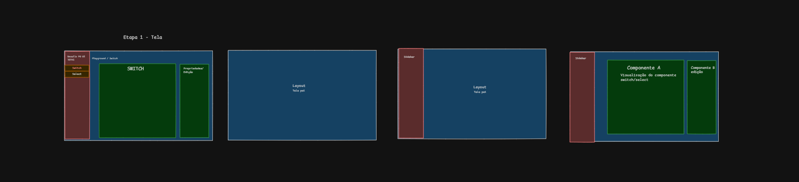

# Select & Switch · Desafio PO UI

Componentes **Select** e **Switch** em Angular 22, seguindo os handoffs do PO UI, e uma página de
demonstração para customizar as propriedades em tempo real.

**Demo:** https://kevinmistrele.github.io/desafio-po-ui/

## Rodando

```bash
npm install
npm start        # http://localhost:4200
```

## A tela

Antes de implementar, desenhei no Excalidraw como a página ficaria organizada:


Depois quebrei a tela em partes, de fora para dentro, para decidir o que seria cada peça:



1. **Layout (tela pai):** a página inteira, que só organiza as áreas.
2. **Sidebar:** fixa à esquerda, com a navegação entre Switch e Select.
3. **Componente A (visualização):** o Switch ou o Select funcionando.
4. **Componente B (edição):** as propriedades que alteram o componente A.

Como A e B compartilham estado (o label digitado em B aparece em A), cada componente ganhou um
playground próprio com os dois painéis dentro. O `App` ficou só com a sidebar e o breadcrumb.

| Área | Função |
|---|---|
| **Menu lateral** | Troca entre os componentes (Switch / Select) |
| **Breadcrumb** | Mostra onde o usuário está (`Playground / Switch`) |
| **Preview** | O componente funcionando, com um card para `[(ngModel)]` e outro para Reactive Forms |
| **Propriedades** | Controles que alteram o componente em tempo real |

A ideia foi caber tudo numa tela só, sem rolar a página no desktop: mudar uma propriedade e ver o
resultado acontecem no mesmo campo de visão. Em telas menores os painéis empilham.

No painel de propriedades dá para alterar:
- **Geral:** label, placeholder, disabled, required, selecionar/limpar o valor (Select); label,
  disabled, ligar/desligar (Switch)
- **Opções (Select):** editar value e label, desabilitar, adicionar e remover opções
- **Estilo:** as cores do handoff, aplicadas ao vivo

A configuração é mantida ao trocar de página no menu.

## Componentes

### `<km-select>`

```html
<km-select label="Cidade" [options]="options" [(ngModel)]="cidade" required />
```

| Input | Tipo | Padrão |
|---|---|---|
| `options` | `SelectOption<T>[]` (obrigatório) | — |
| `placeholder` | `string` | `'Choose an option'` |
| `label` | `string` | `''` |
| `disabled` | `boolean` | `false` |

```ts
interface SelectOption<T = string> {
  value: T;
  label: string;
  disabled?: boolean;
}
```

- Funciona com `[(ngModel)]`, `formControl` e `formControlName`.
- Teclado: ↓ ↑ Home End navegam, Enter/Espaço selecionam, Esc fecha, Tab seleciona e segue.
- Estados do handoff: normal, hover, focus, error (campo inválido depois de tocado) e disabled.

### `<km-switch>`

```html
<km-switch label="Receber notificações" [(ngModel)]="notificacoes" (checkedChange)="onChange($event)" />
```

| Input / Output | Tipo | Padrão |
|---|---|---|
| `label` | `string` | `''` |
| `ariaLabel` | `string` | — |
| `disabled` | `boolean` | `false` |
| `(checkedChange)` | `boolean` | emitido a cada interação |

- Funciona com `[(ngModel)]`, `formControl` e `formControlName`, sempre com `true` ou `false`.
- Estados do handoff: unchecked, checked, hover, focus e disabled (ligado e desligado).

### Tema

Os dois componentes expõem as custom properties com os nomes do handoff. Se não forem definidas,
usam os tokens do tema padrão do PO UI.

```css
km-select {
  --color-focused: #0c9abe;
}
```

- **Select:** `--color`, `--background`, `--text-color`, `--text-color-empty`, `--color-hover`,
  `--background-hover`, `--color-focused`, `--outline-color-focused`, `--color-disabled`,
  `--background-disabled`, `--color-error`, `--font-family`, `--font-size`,
  `--padding-horizontal`, `--padding-vertical`
- **Switch:** `--color-unchecked`, `--border-color`, `--track-unchecked`, `--color-checked`,
  `--track-checked`, `--color-unchecked-hover`, `--color-checked-hover`, `--outline-color-focused`,
  `--color-unchecked-disabled`, `--color-checked-disabled`

## Estrutura

```
src/app/
  app.*                  menu lateral + breadcrumb
  ui/                    os componentes do desafio
    select/
    switch/
  features/playground/   a página de demonstração
    select/  switch/  shared/
```

`ui/` não importa nada de `features/`: os componentes não dependem da demo e poderiam virar uma
biblioteca sem mudanças.

## Decisões

- **ControlValueAccessor em vez de FormValueControl:** no Angular 22.2, com `FormValueControl`, o
  `required` do template-driven era ignorado (campo vazio ficava `valid`). Com o CVA todos os casos
  pedidos funcionam.
- **Select próprio:** o `<select>` nativo não permite o visual da lista aberta do handoff (✓, cores,
  item ativo). Segui o padrão WAI-ARIA "Select-only Combobox" para teclado e leitor de tela.
- **Switch sobre `<button role="switch">`:** foco, Tab, Espaço/Enter e disabled vêm do navegador. O
  CSS lê o mesmo `aria-checked` que o leitor de tela anuncia.
- **Signals, standalone e zoneless**, os padrões do Angular 22.

## Limitações conhecidas

- A lista do Select usa `position: absolute`: dentro de um container com `overflow: hidden` ela
  seria cortada. Em produção usaria CDK Overlay ou a Popover API.
- A cor do placeholder do handoff (`#b6bdbf` sobre `#fbfbfb`) tem contraste de ~1,8:1, abaixo do
  WCAG AA (4,5:1). Mantive fiel ao handoff; é um ponto que eu levaria ao time de design.
- Testes unitários ficaram fora do escopo por prazo.

O registro completo do processo (fases, decisões e problemas resolvidos) está em
[`docs/processo.md`](docs/processo.md).
