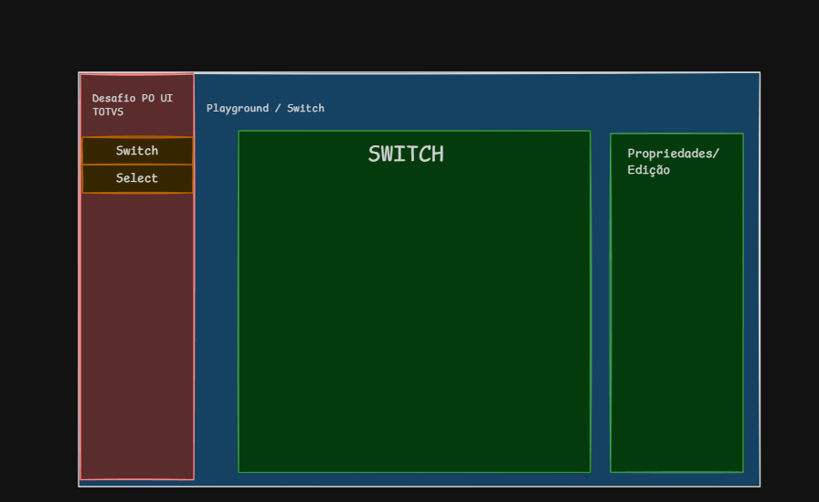

# Processo de desenvolvimento

Registro do que foi feito, em que ordem e por quê. Atualizado a cada fase.

| Fase                                 | Status               |
|--------------------------------------|----------------------|
| 0. Ambiente, projeto e tokens        | ✅ Concluída (24/09)  |
| 1. Estrutura e design da tela        | ✅ Concluída (25/09)  |
| 2. Arquitetura de pastas             | ✅ Concluída (25/09)  |

---

## Fase 0: Ambiente, projeto e tokens (24/09)

- Projeto criado com Angular CLI 22.2 (Node 24): standalone, zoneless, OnPush por padrão.
- Prefixo `km-` nos seletores (`km-switch`, `km-select`), pra não confundir com o `<select>` nativo.
- Tokens do tema default do PO UI declarados em `src/styles.css` (só os usados pelos handoffs).

## Fase 1: Estrutura e design da tela (25/09)

Antes de implementar os componentes, desenhei no Excalidraw como a tela ficaria organizada.



### Organização

```
┌──────────────┬───────────────────────────────────────────────┐
│ Desafio PO UI│ Playground / Switch                           │
│ TOTVS        │ ┌──────────────────────────┐ ┌──────────────┐ │
│              │ │          SWITCH          │ │ Propriedades │ │
│ [ Switch ]   │ │                          │ │   / Edição   │ │
│ [ Select ]   │ │        (preview)         │ │              │ │
│              │ │                          │ │              │ │
│              │ └──────────────────────────┘ └──────────────┘ │
└──────────────┴───────────────────────────────────────────────┘
```

| Área | Função |
|---|---|
| **Menu lateral** | Troca entre os componentes (Switch / Select) |
| **Breadcrumb** | Mostra onde o usuário está (`Playground / Switch`) |
| **Preview** | O componente funcionando (ngModel e Reactive Forms) |
| **Propriedades** | Controles que alteram o componente em tempo real (pedido do PDF) |

A tela cabe inteira na janela (sem rolar a página no desktop): mudar uma propriedade e ver o
resultado acontece no mesmo campo de visão, o que deixa a demo mais fácil de entender e de usar.

### Implementação da casca (`src/app/app.*`)

**Estado:** um único signal com a página ativa.
```ts
protected readonly pages: readonly Page[] = [
  { id: 'switch', label: 'Switch' },
  { id: 'select', label: 'Select' },
];
protected readonly activePage = signal(this.pages[0]);
```
O menu, o breadcrumb e o título do preview leem desse mesmo signal, então nunca ficam fora de
sincronia. O `id` tipado (`'switch' | 'select'`) impede um valor inválido.

**Menu:** `<nav>` com `<button>` nativos (foco e teclado de graça). O item ativo recebe
`aria-current="page"`, que o leitor de tela anuncia como "página atual", e o CSS usa o mesmo
atributo pra pintar o destaque.

**Layout (CSS Grid):**
- `:host` com duas colunas: menu `14rem` + área de trabalho flexível, altura `100dvh`.
- Área de trabalho com duas colunas: preview flexível + propriedades `20rem`.
- `min-height: 0` + `overflow-y: auto` nos painéis: se um conteúdo crescer, só aquele painel rola.
- Abaixo de `900px` tudo empilha e a página rola normalmente.
- Cores só dos tokens do PO UI (`--color-action-default`, `--color-brand-01-lightest`...).

**Ponto de extensão:** a casca não sabe nada dos componentes. O conteúdo de cada página entra
depois, num playground por componente (ver fase 2).

---

## Fase 2: Arquitetura de pastas (25/09)

Depois da tela, desenhei a organização das pastas. A primeira versão:

```
src/
  features/playground/   playground-page.ts | .html | .css
  ui/components/
    switch/  select/  Sidebar/  Cards/
```

Revisando, mantive a ideia central e ajustei três pontos.

### Decisão final

```
src/app/
  app.ts | app.html | app.css      ← casca: sidebar + breadcrumb
  ui/                              ← BIBLIOTECA: só o que o desafio entrega
    switch/   switch.ts | .html | .css | .spec.ts
    select/   select.ts | .html | .css | .spec.ts | select-options.ts
  features/playground/             ← CONSUMIDOR: a página de demo
    switch/   switch-playground.ts | .html
    select/   select-playground.ts | .html
    shared/   style-editor.ts      ← usado pelos dois playgrounds
    playground.css                 ← .panel e layout, compartilhado
```

> Ajuste feito depois da primeira reorganização: cada playground ganhou sua pasta e o que é usado
> pelos dois foi pra `shared/`, espelhando a organização de `ui/`.

### Por quê

**Biblioteca separada do consumidor (mantido da versão original).** `ui/` nunca importa nada de
`features/`. Os componentes do desafio poderiam virar uma biblioteca sem nenhuma mudança, e isso
prova que eles são reutilizáveis de verdade.

**Sidebar e Card saíram de `ui/`.** `ui/` representa o que o desafio entrega (Select e Switch).
Sidebar e Card são peças desta página específica; colocá-los ao lado passaria a ideia de quatro
componentes reutilizáveis.

**Sidebar e Card não viraram componentes.** A sidebar aparece uma vez e tem ~20 linhas no
`app.html`; um componente só adicionaria arquivo, `imports` e comunicação pai/filho pra saber a
página ativa. O card é só aparência (fundo, borda, espaçamento): uma classe CSS `.panel` resolve.
Viraria componente se ganhasse comportamento ou estrutura própria.

**Um playground por componente.** O Select tem bastante estado (editor de opções, required,
cores) e o Switch outro. Separados, cada arquivo fica pequeno e focado.

**Convenções do style guide:** pastas e arquivos em minúsculo, singular e kebab-case; nomes sem
sufixo `.component` (`switch.ts`, classe `Switch`).

---

## Uso de IA neste teste

O PDF pede uso moderado de IA, então deixo registrado como usei. Tratei a IA principalmente como
apoio de estudo, e não como quem faz o trabalho.

**Para entender o Angular atual.** Eu vinha de uma versão mais antiga do Angular, e muita coisa do
core mudou: diretivas, ciclo de vida, change detection, a forma de declarar inputs e outputs. Usei a
IA para entender o que cada coisa faz, se funciona exatamente como antes e, quando não, por que
mudou. O mesmo para as sintaxes novas (`@if`, `@for`, `input()`, `computed()`...). A ideia era
entender o porquê de cada escolha, não só fazer funcionar.

**Para organizar pensamentos e ideias.** Antes de cada fase, usei a IA para discutir e organizar o
que eu queria fazer, e depois registrar as decisões neste documento.

**Para depurar.** Quando aparecia um erro, usei a IA para entender a causa e então corrigir.

**Para código**, usei principalmente no playground (a página de demonstração). Também me ajudou a
dar mais visibilidade ao projeto e a melhorar o README.

**O que foi meu:**
- **O design da tela.** Desenhei no Excalidraw e quebrei a tela em partes (layout, sidebar, área de
  visualização e área de edição) pensando em quem vai avaliar: tudo numa tela só, sem rolagem,
  para mudar uma propriedade e ver o resultado ao mesmo tempo.
- **A arquitetura.** A separação entre `ui/` (os componentes do desafio) e `features/` (a demo),
  e a decisão de não transformar a sidebar e os cards em componentes, porque não tinham
  comportamento próprio.
- **O escopo.** Entregar o que o PDF e os handoffs pedem, bem feito, sem enfeite.
- **A validação.** Testei manualmente todos os estados dos handoffs (hover, focus, error, disabled),
  o teclado e os dois tipos de formulário, e revisei tudo que entrou no repositório.

---

## Conceitos que ficaram claros neste desafio

O jeito de montar componentes no Angular atual mudou muito em relação ao Angular que eu usava no
trabalho, e isso me fez olhar o framework com outros olhos:

- **Sem NgModule:** cada componente é standalone e importa só o que usa. Some aquela camada de
  módulos que tinha que declarar e exportar tudo.
- **Change detection mais simples:** com signals e zoneless, a tela só atualiza quando um signal
  muda. O OnPush já é o padrão, então não preciso mais pensar em quando marcar o componente para
  atualizar.
- **APIs novas no lugar das antigas:** `input()` e `output()` no lugar de `@Input()`/`@Output()`,
  `@if`/`@for` no lugar das diretivas `*ngIf`/`*ngFor`.

Mudou MUITA coisa, e várias vezes precisei parar para entender por que X e não Y. As diretivas são
um bom exemplo: entender por que `ngModel` e `formControl` precisam de um `ControlValueAccessor`
para conversar com um componente próprio foi o que fez o Select e o Switch funcionarem com os dois
tipos de formulário.

